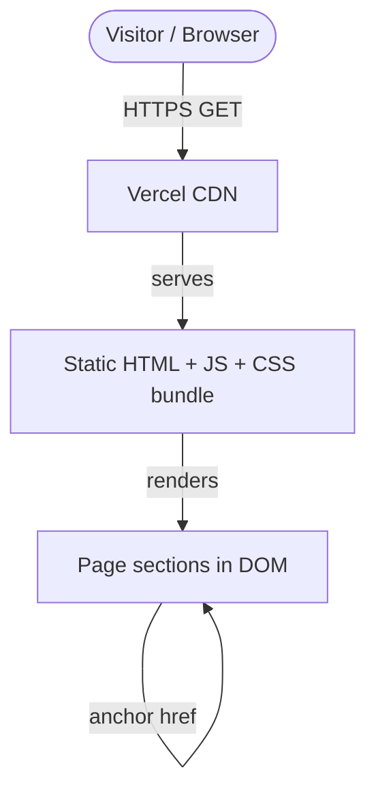
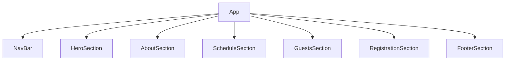
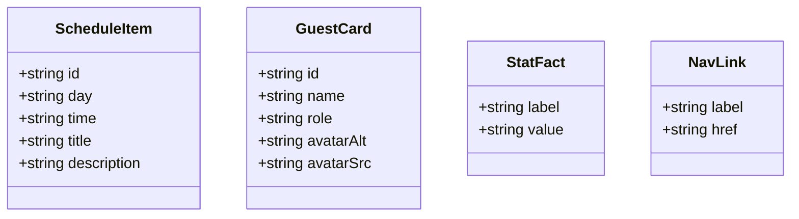

# Architecture — ClawCon Bogota Landing Page

## 1. Overview

ClawCon Bogota is a single-page marketing site for a tabletop gaming convention
held in Bogota, Colombia. The site targets prospective attendees and
communicates event details, schedule, featured guests, and a registration
call-to-action. It is an MVP: the first publicly shippable version, deployed
to Vercel, with no server-side logic and no external data fetching.

## 2. Solution type and scope

**Type:** MVP

**In scope:**
- Seven page sections: Navigation, Hero, About, Schedule/Activities,
  Guests/Featured Games, Registration CTA, Footer (F01–F07)
- Responsive layout: mobile-first CSS, breakpoints at 640 px (sm) and 1024 px (lg)
- Accessibility landmarks and keyboard navigation throughout
- Smooth-scroll anchor navigation
- Hamburger/toggle menu collapsing on mobile (F07)
- Static, hardcoded content (no CMS, no API calls)
- Design tokens via `DESIGN.md` → `src/theme/tokens.css`
- Vercel deployment (FDEPLOY)

**Out of scope:**
- Server-side rendering (no Next.js or Remix)
- Authentication or user accounts
- A real ticketing/payment integration (CTA button links to a placeholder URL)
- CMS-driven content or i18n
- Animation libraries or complex motion design
- Dark-mode toggle (single color scheme, tokens may include dark values)
- Analytics or third-party tracking scripts
- A contact form with backend submission
- Multiple pages or client-side routing

**Assumptions:**
- All event content (dates, venue, guest names, schedule items) is static and
  can be hardcoded; no data fetching layer is needed.
- The designer will update `DESIGN.md` with a bold, vibrant palette (Latin
  American festival + gamer aesthetic) before implementation begins.
- The implementer targets Chrome, Firefox, Safari (modern evergreen); IE is
  not supported.
- The hamburger menu is implemented with pure React state (`useState`) and
  CSS — no external menu library.

## 3. Functional requirements

Traceable to `feature_list.json` IDs.

- FR-1 (F01): The hero section occupies the full viewport height, displays the
  event name as the primary `<h1>`, tagline, date (August 2026), location
  (Bogota, Colombia), and a "Register Now" CTA button.
- FR-2 (F02): The about section uses semantic `<section>` markup, contains a
  descriptive paragraph, and displays at least three key stat facts (attendee
  count, venue, event duration) in a visually distinct layout.
- FR-3 (F03): The schedule section lists at least four activity items, each
  with a title, day/time slot, and short description, in a card or list layout
  that stacks vertically on mobile and becomes a grid on desktop.
- FR-4 (F04): The guests section renders at least three guest or featured-game
  cards, each with a name, role/description, and an accessible avatar
  placeholder (image with `alt` text or an ARIA-labeled decorative element).
- FR-5 (F05): The registration CTA section has a headline, supporting copy, and
  a prominent CTA button linking to `#register` or a placeholder URL. Its
  background is visually distinct from adjacent sections.
- FR-6 (F06): The footer contains the event name, social-media link
  placeholders with accessible labels, a `mailto:` contact link, and a
  copyright notice. It uses a `<footer>` landmark element.
- FR-7 (F07): The navigation bar contains the event name/logo and anchor links
  to each section (`#hero`, `#about`, `#schedule`, `#guests`, `#register`,
  `#footer`). It collapses to a toggle/hamburger button on mobile. Keyboard
  focus order and `aria-expanded` state are correct.

## 4. Non-functional requirements

| Attribute       | Target                                        | Rationale                                    | Priority |
|-----------------|-----------------------------------------------|----------------------------------------------|----------|
| Performance     | Lighthouse performance >= 90 on mobile        | Single static page; no excuse for slowness  | must     |
| Accessibility   | Zero axe-core violations in automated scan    | Legal baseline; broad audience               | must     |
| Responsiveness  | Usable at 320 px – 1440 px viewport widths    | Most Colombian mobile users on small screens | must     |
| Maintainability | All colors/spacing via design tokens; no magic values | Tokens enforced by `design:check` gate | must     |
| Test coverage   | One test per component covering the happy path | Reviewer gate requires green `./init.sh`    | must     |
| Build           | `npm run build` produces zero TS/lint errors  | Vercel deploy gate                           | must     |
| Bundle size     | No unneeded runtime dependencies              | Marketing page; only React is justified      | should   |

## 5. System context

The site has no backend. The browser fetches a static bundle from Vercel's CDN.



## 6. Component breakdown

### File layout

```
src/
  components/
    NavBar/
      NavBar.tsx          — Responsive top nav; hamburger toggle state
      NavBar.css
    HeroSection/
      HeroSection.tsx     — Full-viewport hero; event name, tagline, date, CTA
      HeroSection.css
    AboutSection/
      AboutSection.tsx    — Event description + key-stat facts
      AboutSection.css
    ScheduleSection/
      ScheduleSection.tsx — Activity/schedule card grid
      ScheduleSection.css
    GuestsSection/
      GuestsSection.tsx   — Guest / featured-game card grid
      GuestsSection.css
    RegistrationSection/
      RegistrationSection.tsx — CTA headline + button
      RegistrationSection.css
    FooterSection/
      FooterSection.tsx   — Social links, contact, copyright
      FooterSection.css
  hooks/
    useNavMenu.ts         — Hamburger open/close state + keyboard handling
  theme/
    tokens.css            — Generated; never hand-edit
  App.tsx                 — Composes all sections in DOM order
  App.css                 — Global resets + layout utilities
  index.css               — :root imports tokens.css
```

There is no `src/api/` directory because all content is static. If dynamic data
(e.g., a live attendee count API) is added in a future iteration, an `api/`
layer should be introduced then.

### Critical-path interaction: hamburger menu

```mermaid
sequenceDiagram
    participant User
    participant NavBar
    participant useNavMenu

    User->>NavBar: clicks hamburger button (mobile)
    NavBar->>useNavMenu: toggle()
    useNavMenu-->>NavBar: isOpen = true
    NavBar-->>User: nav links slide in / become visible

    User->>NavBar: clicks a nav link
    NavBar->>useNavMenu: close()
    useNavMenu-->>NavBar: isOpen = false
    NavBar-->>User: menu collapses; page scrolls to section
```

### Page composition order



### Responsive strategy

- **Mobile-first:** base styles target 320 px. `@media (min-width: 640px)` for
  tablet adjustments; `@media (min-width: 1024px)` for desktop grid layouts.
- **No CSS framework.** All layout is plain CSS Grid and Flexbox using design
  tokens for spacing.
- **Section max-width:** a `--layout-max-width` token (set to 1200 px) constrains
  inner content; sections span full viewport width with token-based padding.

### Accessibility landmarks

Every section receives a semantic landmark and a unique `id` used for anchor
navigation:

| Element              | id / aria attribute     | Landmark role  |
|----------------------|-------------------------|----------------|
| `<header>`           | —                       | `banner`       |
| `<nav>`              | `aria-label="Main"`     | `navigation`   |
| `<main>`             | —                       | `main`         |
| `<section id="hero">`| `aria-labelledby`       | region         |
| `<section id="about">` | `aria-labelledby`     | region         |
| `<section id="schedule">` | `aria-labelledby` | region         |
| `<section id="guests">` | `aria-labelledby`    | region         |
| `<section id="register">` | `aria-labelledby` | region         |
| `<footer>`           | —                       | `contentinfo`  |

Each `<section>` must have a visible heading (`<h2>`) that the
`aria-labelledby` references, making the landmark self-describing for screen
readers.

## 7. Data model

All content is static; there is no persistent data store. The domain objects
below represent the TypeScript types used to shape static data constants.



Static data constants live alongside their component (e.g.,
`HeroSection/heroData.ts`) so the implementer can replace placeholder values
with real content without touching component logic.

## 8. Technology decisions

| Decision                  | Chosen option               | Alternatives considered          | Rationale                                                   |
|---------------------------|-----------------------------|----------------------------------|-------------------------------------------------------------|
| Build tool                | Vite 6                      | CRA, Parcel                      | Already in scaffold; fast HMR, native ESM                   |
| UI framework              | React 19 + TypeScript strict | Vue, Svelte                     | Already in scaffold; team familiarity assumed               |
| Styling                   | Plain CSS Modules co-located | Tailwind, styled-components      | No new runtime dep; tokens enforced by design:check        |
| Test runner               | Vitest + RTL                | Jest                             | Already in scaffold; native Vite integration               |
| Routing                   | None (anchor links)         | React Router                     | Single page; no client-side route changes needed           |
| State management          | useState / custom hook      | Zustand, Redux                   | Only one stateful UI element (hamburger); no store needed  |
| Deployment                | Vercel                      | Netlify, GitHub Pages            | Specified by project; zero-config for Vite                  |

## 9. Risks and trade-offs

1. Risk: Static content quickly becomes stale (wrong dates, guest changes).
   Impact: medium. Mitigation: extract all content to typed data constants so
   future edits are isolated and reviewable. Document update process in README.

2. Risk: Hamburger menu keyboard trap on mobile — focus may not return to the
   toggle button when menu closes.
   Impact: high (accessibility). Mitigation: `useNavMenu` must manage focus
   explicitly; reviewer checks keyboard flow.

3. Risk: `design:check` gate rejects implementation if tokens are missing.
   Impact: medium (blocks CI). Mitigation: implementer must request new tokens
   from the designer before hardcoding any value.

4. Risk: Avatar images are placeholder-only; broken images degrade layout on
   real launch.
   Impact: low for MVP. Mitigation: use CSS-generated initials avatars so no
   `` with real src is needed for the MVP.

5. Risk: `scroll-behavior: smooth` is unsupported in very old Safari and
   reduced-motion users may find it disorienting.
   Impact: low. Mitigation: apply `scroll-behavior: smooth` only when the
   `prefers-reduced-motion` media query is not active.

## 10. Definition of done

These criteria feed directly into `CHECKPOINTS.md`.

- [ ] `./init.sh` finishes with `[OK] Environment ready` (runs lint, typecheck,
      design:check, and full test suite).
- [ ] Each section (F01–F07) renders its required content and passes its
      acceptance criteria as listed in `feature_list.json`.
- [ ] All design tokens used — no hardcoded hex values, no off-scale spacing.
- [ ] Zero TypeScript errors (`npm run typecheck`).
- [ ] Zero ESLint errors (`npm run lint`).
- [ ] All interactive elements (CTA buttons, nav links, hamburger toggle) are
      reachable and operable by keyboard alone.
- [ ] Each section has a visible `<h2>` heading and a correct `id` anchor.
- [ ] Responsive layout verified at 320 px, 640 px, and 1024 px viewports.
- [ ] At least one Vitest test per component covering the primary happy path.
- [ ] `npm run build` completes without errors.
- [ ] Deployed to Vercel and live HTTPS URL returned (FDEPLOY).
