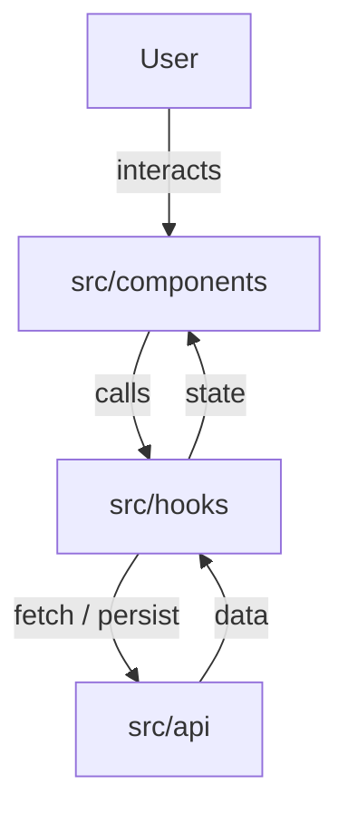

# Architecture — What it means to "do good work"

> This is the placeholder architecture for the React harness. The `architect`
> agent overwrites it with project-specific decisions. The principles below are
> the defaults a generated React app should follow unless a feature documents a
> reason to deviate.

## Principles

1. **Clear layers.** Keep three responsibilities separate:
   - `src/components/` — React components (presentational + container). UI only.
   - `src/hooks/` — reusable stateful logic (custom hooks). No JSX.
   - `src/api/` — data fetching / persistence. No UI, no React.
     Do not introduce extra layers (stores, contexts, services) until a feature in
     `feature_list.json` documents a concrete reason.

2. **Design tokens, not magic values.** All colors, spacing, radius, and
   typography come from `DESIGN.md` via the generated `src/theme/tokens.css`
   custom properties (`var(--color-*)`, `var(--space-*)`, …). Never hardcode a
   hex color or an off-scale pixel value. The design system is owned by the
   `designer` agent.

3. **Minimal dependencies.** Prefer the platform and React itself. A new runtime
   dependency must be justified in `feature_list.json` (status `blocked` until
   discussed). Dev tooling (test/lint/build) is exempt.

4. **Typed boundaries.** Public component props, hook return types, and API
   shapes are explicitly typed. `strict` TypeScript; no `any` at boundaries.

5. **Accessible by default.** Use semantic HTML and roles. Interactive elements
   are reachable by keyboard and have accessible names. Tests query by role/label
   like a user, which keeps the UI accessible.

6. **Pure where possible.** Keep components and hooks free of side effects except
   in `useEffect` / event handlers. Data fetching lives in `src/api/` and is
   called from hooks, not inline in render.

## Data flow

## What NOT to do

- Do not hardcode colors/spacing/fonts. Use the design tokens.
- Do not put data-fetching logic directly in component render bodies.
- Do not mutate props or state objects in place; produce new values.
- Do not reach across layers (a component importing from `src/api/` directly
  instead of through a hook) without a documented reason.
- Do not leave `console.log` debug statements or commented-out code.
